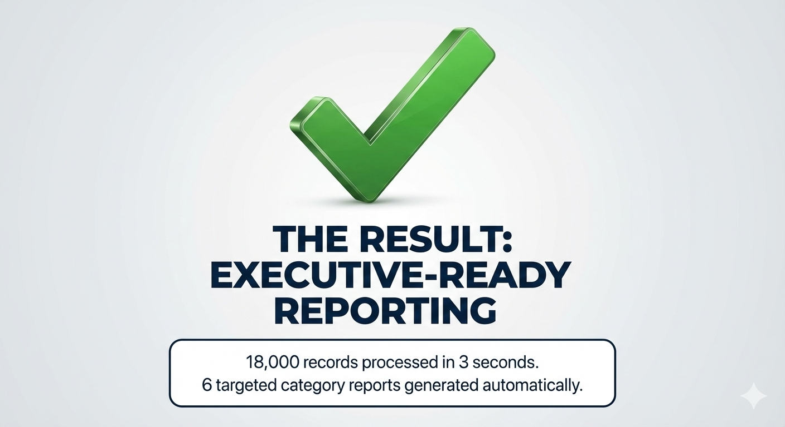

# 🐍 Python Data Automation Portfolio
**By Anil Dangi**

Welcome to my portfolio. I specialize in building automated pipelines to transform messy, high-volume data into executive-ready MIS reports.

---

## 📊 Project 1: Scalable Data Segmentation (18,000+ Records)
**The Challenge:** Automate the categorization of a massive dataset into dynamic, multi-sheet Excel reports.

### Key Solutions:
- **Dynamic Multi-Sheet Generation:** Automated creation of 6 targeted category reports from one master file.
- **High Performance:** Optimized Pandas logic to process **18,000+ rows in under 3 seconds.**
- **Data Integrity:** 100% accuracy in demographic mapping and name merging.

---

## 📈 Project 2: Investor Status Report (5,500+ Records)
**The Challenge:** Extract legal status codes from PAN numbers and aggregate investor counts.

### Key Solutions:
- **Logic Mapping:** Created a dictionary-based system to translate raw status codes into full descriptions.
- **Automation:** Reduced 8 hours of manual entry into a 2-second script.

[Link to Code for Project 2](./my_logic.py)

---

## 🛠️ Tech Stack
- **Language:** Python 3.x
- **Libraries:** Pandas, Openpyxl, File I/O
- **Focus:** Data Cleaning, MIS Automation, Business Logic Building
